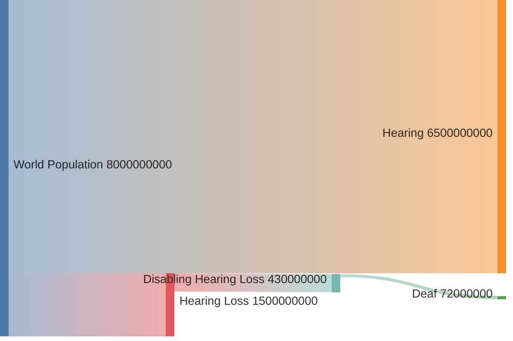

# Numbers

Understanding the scale and impact of hearing loss is essential for assistive technologies.
This section explores the global funnel from hearing loss to deafness and its significance.

1. **1.5 billion people** experience hearing loss globally.
2. **430 million people** require rehabilitation for disabling hearing loss.
3. **70 million people** are considered deaf.
4. **8[^ecml]-24[^derivation] million people** natively use sign languages.

[^ecml]: European Centre for Modern Languages. 2024. [Facts about sign language](https://edl.ecml.at/Facts/FAQsonsignlanguage/tabid/2741/language/en-GB/Default.aspx).
[^derivation]: Derivation. 2022. [International Day of Sign Languages 2022](https://derivation.co/international-day-of-sign-languages-2022/).

### Hearing Loss[^who]

The **World Health Organization (WHO)** estimates that globally, **1.5 billion people** live with some degree of hearing loss, a number expected to rise to **2.5 billion by 2050**.
Of these, **430 million people** experience disabling hearing loss, requiring rehabilitation to improve quality of life.
By 2050, this number is projected to grow to **700 million**.

::: info Quote: Relevance ([learn more](/facts/market#economic-impact))
Unaddressed hearing loss poses an annual global cost of US $980 billion.
This includes health sector costs (excluding the cost of hearing devices), costs of educational support, loss of productivity and societal costs.
:::

[^who]: World Health Organization. 2021. [Fact Sheet: Deafness and Hearing Loss](https://www.who.int/news-room/fact-sheets/detail/deafness-and-hearing-loss).

These impairments are defined per ear, as follows[^who-report]:

| **Grade**                                     | **Hearing Loss (dB)** | **Description**                                                                                                      |
| --------------------------------------------- | --------------------- | -------------------------------------------------------------------------------------------------------------------- |
| **0: No impairment**                          | 0–25 dB               | Normal hearing or no significant hearing difficulty.                                                                 |
| **1: Slight impairment**                      | 26–40 dB              | Able to hear and repeat words spoken in normal voice at 1 meter; may have difficulty in noisy settings.              |
| **2: Moderate impairment**                    | 41–60 dB              | Able to hear and repeat words spoken in raised voice at 1 meter; struggles with conversation.                        |
| **3: Severe impairment**                      | 61–80 dB              | Able to hear some words when shouted directly into the ear; significant communication challenges.                    |
| **4: Profound impairment including deafness** | >80 dB                | Unable to hear and understand even when shouted directly into the ear; often relies on visual communication methods. |

[^who-report]: World Health Organization. 1991. [Report of the informal working group on prevention of deafness and hearing impairment programme planning](http://www.who.int/iris/handle/10665/58839).

### Deafness[^wfd]

Among those with disabling hearing loss, the **World Federation of the Deaf (WFD)** estimates there are approximately **70 million deaf people worldwide**.
This community spans over **200 sign languages**, underlining the linguistic diversity of deaf populations.
From our research, it is unclear how many people use sign languages.

[^wfd]: World Federation of the Deaf. 2024. [Our Work](https://wfdeaf.org/our-work/).

It is unclear how many people use sign languages.
The European Centre for Modern Languages[^ecml] estimates that on average,
deaf sign language users make up about 0.1% of the whole population in any given country, amounting to 8 million people worldwide.
According to Ethnologue (via Derivation[^derivation]), there are 24 million native sign language users worldwide.
