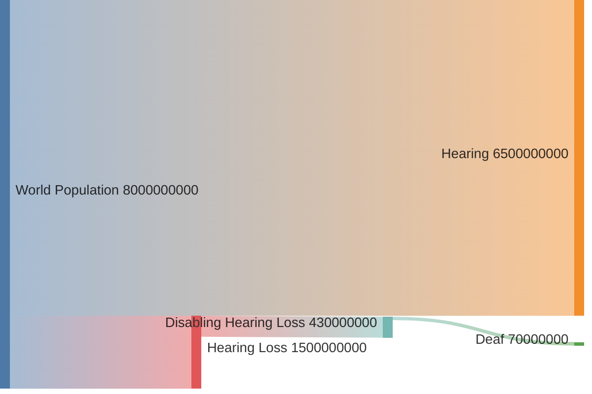

# Population

Understanding the scale and impact of hearing loss is essential for developing effective assistive technologies.
This section outlines the global scope and significance of hearing loss and deafness.

1. **1.5 billion people** experience hearing loss globally.
2. **430 million people** require rehabilitation for disabling hearing loss.
3. **70 million people** are considered deaf.
4. **12[^ecml]-24[^derivation]-25[^sheets] million people** primarily use sign languages.

### Hearing Loss[^who]

The **World Health Organization (WHO)** estimates that globally, **1.5 billion people** live with some degree of hearing loss, a number expected to rise to **2.5 billion by 2050**. This increase is driven by factors such as population aging, unsafe listening habits, limited access to care, preventable causes going untreated, and insufficient early screening.
Of these, **430 million people** experience disabling hearing loss, requiring rehabilitation to improve quality of life.
By 2050, this number is projected to grow to **700 million**.

:::info Quote: Relevance ([learn more](../market#economic-impact))
The WHO estimates that unaddressed hearing loss poses an annual global cost of US$ 980 billion.
This figure includes health sector costs (excluding hearing devices), educational support, loss of productivity, and broader societal costs.
:::

[^who]: World Health Organization. 2021. [Fact Sheet: Deafness and Hearing Loss](https://www.who.int/news-room/fact-sheets/detail/deafness-and-hearing-loss).

These impairments are defined per ear, as follows[^who-report]:

| **Grade**                                     | **Hearing Loss (dB)** | **Description**                                                                                                      |
| --------------------------------------------- | --------------------- | -------------------------------------------------------------------------------------------------------------------- |
| **0: No impairment**                          | 0–25 dB               | Normal hearing or no significant hearing difficulty.                                                                 |
| **1: Slight impairment**                      | 26–40 dB              | Able to hear and repeat words spoken in normal voice at 1 meter; may have difficulty in noisy settings.              |
| **2: Moderate impairment**                    | 41–60 dB              | Able to hear and repeat words spoken in raised voice at 1 meter; struggles with conversation.                        |
| **3: Severe impairment**                      | 61–80 dB              | Able to hear some words when shouted directly into the ear; significant communication challenges.                    |
| **4: Profound impairment including deafness** | >80 dB                | Unable to hear and understand even when shouted directly into the ear; often relies on visual communication methods. |

[^who-report]: World Health Organization. 1991. [Report of the informal working group on prevention of deafness and hearing impairment programme planning](http://www.who.int/iris/handle/10665/58839).

### Deafness[^wfd]

Among those with disabling hearing loss, the **World Federation of the Deaf (WFD)** estimates there are approximately **70 million deaf people worldwide**.
This community spans over **200 sign languages** (or over _300_[^un-national-day]), underlining the linguistic diversity of deaf populations.

[^wfd]: World Federation of the Deaf. 2024. [Our Work](https://wfdeaf.org/our-work/).

[^un-national-day]: United Nations. 2024. [International Day of Sign Languages](https://www.un.org/en/observances/sign-languages-day).

From our research, it is unclear how many people use sign languages.
The European Centre for Modern Languages[^ecml] estimates that on average,
deaf sign language users make up about 0.16% of the whole population in any given country, amounting to 12 million people worldwide.
According to Ethnologue (via Derivation[^derivation]), there are 24 million native sign language users worldwide,
and according to a conglomeration of sources[^sheets], the number signers for the top 100 used sign languages is 25 million.

[^ecml]: European Centre for Modern Languages. 2024. [Facts about sign language](https://edl.ecml.at/Facts/FAQsonsignlanguage/tabid/2741/language/en-GB/Default.aspx).

[^derivation]: Derivation. 2022. [International Day of Sign Languages 2022](https://derivation.co/international-day-of-sign-languages-2022/).

[^sheets]: Shester Gueuwou. 2023. [Sign Language Info](https://docs.google.com/spreadsheets/d/1O6frH52v4R9RbhWOA-FqRj2W3U-0yC2xC3qroxcq4kQ/edit?gid=1380277111#gid=1380277111)

### Sign Language Interpreters

Sign language interpreters are a rare commodity, and are globally in shortage.
In Israel, a survey conducted among the organization's members found that 67% of interpreters refuse to attend a single-hour interpretation order.[^isl-shortage]

We list the number of interpreters in various countries below. For all countries in Europe, visit https://www.eud.eu/member-countries/.

| Country            | Population            | HoH Population                                              | Deaf Population                            | Interpreters                                                        | Deaf Interpreters                           |
| ------------------ | --------------------- | ----------------------------------------------------------- | ------------------------------------------ | ------------------------------------------------------------------- | ------------------------------------------- |
| United States      | 331 million (2023)    | 11[^disabilitystatistics]-12[^researchondisability] million | 1 million[^mitchell]                       | 10,385[^rid]                                                        |                                             |
| India              | 1.4 billion (2023)    |                                                             | 2 million[^wfdeaf-sig]                     | 300[^wfdeaf-sig]                                                    |                                             |
| Germany            | 83 million[^aiic-ch]  |                                                             | 200,000[^eud-germany][^ddl]                | 750[^eud-germany]                                                   | 26-30[^ddl]                                 |
| Switzerland        | 8.7 million[^aiic-ch] | 800,000[^swissinfo]                                         | 10,000[^swissinfo][^ddl][^eud-switzerland] | 63 Swiss-German, 32 Swiss-French, 8 Swiss-Italian[^eud-switzerland] | (1-5 Swiss-German, 1-5 Swiss-Italian)[^ddl] |
| Israel             | 9.7 million (2023)    | 55,700[^cbs-isl]                                            | 10,000[^isl-deaf]                          | 147[^isl-interpreters]-200[^isl-shortage]                           |                                             |
| The United Kingdom |                       |                                                             | 77,000[^ddl]                               |                                                                     | 16-20[^ddl]                                 |
| Slovenia           |                       |                                                             | 1016[^eud-slovenia]                        | 61[^eud-slovenia]                                                   | 2-5[^ddl]                                   |
| Spain              |                       |                                                             | 100,000[^eud-spain]                        | 667[^eud-spain]                                                     | <15[^ddl]                                   |
| Austria            |                       |                                                             | 8,000 – 10,000[^ddl][^eud-austria]         | 150[^eud-austria]                                                   | 5[^ddl]                                     |
| Belgium            |                       |                                                             | 6,500[^eud-belgium] - 9,000[^ddl]          | 165[^eud-belgium]                                                   | (5-10 Flanders, 16-26 Wallonia)[^ddl]       |

[^eud-slovenia]: European Union of the Deaf. 2024. [Member Countries: Slovenia](https://www.eud.eu/member-countries/slovenia/).

[^eud-spain]: European Union of the Deaf. 2024. [Member Countries: Spain](https://www.eud.eu/member-countries/spain/).

[^eud-switzerland]: European Union of the Deaf. 2024. [Member Countries: Switzerland](https://www.eud.eu/member-countries/switzerland/).

[^eud-austria]: European Union of the Deaf. 2024. [Member Countries: Austria](https://www.eud.eu/member-countries/austria/).

[^eud-belgium]: European Union of the Deaf. 2024. [Member Countries: Belgium](https://www.eud.eu/member-countries/belgium/).

[^eud-germany]: European Union of the Deaf. 2024. [Member Countries: Germany](https://www.eud.eu/member-countries/germany/).

[^ddl]: Danish Deaf Association. 2016. [Deaf Interpreters in Europe](https://ddl.dk/wp-content/uploads/Deaf-interpreters-in-Europe-2016.pdf).

[^isl-shortage]: Omer Sharvit. 2022. [מחסור חמור במתורגמנים לשפת הסימנים](https://www.zman.co.il/285475/popup).

[^cbs-isl]: Central Bureau of Statistics, 2024. [Data on People with Hearing Impairments in Israel on the Occasion of World Hearing Day 2024](https://www.cbs.gov.il/he/mediarelease/DocLib/2024/065/11_24_065b.pdf).

[^isl-deaf]: Meir et al. 2010. [Emerging sign languages](https://signlab.haifa.ac.il/wp-content/uploads/2013/01/Emerging-Sign-Languages.pdf).

[^isl-interpreters]: Malach Israel. 2024. [רשימת מתורגמנים](https://malachisrael.org/organization-members/interpreters-list/).

[^swissinfo]: Swissinfo. 2021. [Positive signs: Swiss Deaf Federation marks 75 years of adversity](https://www.swissinfo.ch/eng/society/positive-signs-swiss-deaf-federation-marks-75-years-of-adversity/46779982).

[^aiic-ch]: International Association of Conference Interpreters. 2024. [The Swiss Interpreting Market](https://aiic.ch/the-swiss-interpreting-market/).

[^disabilitystatistics]: Disability Statistics. 2022. [Disability Statistics](https://www.disabilitystatistics.org/).

[^researchondisability]: Center for Research on Disability. 2023. [Build Your Own Statistics](https://www.researchondisability.org/ADSC/build-your-own-statistics).

[^mitchell]: Mitchell, Ross E. 2005. [How many deaf people are there in the United States? Estimates from the Survey of Income and Program Participation](https://pubmed.ncbi.nlm.nih.gov/16177267/).

[^rid]: Registry of Interpreters for the Deaf. 2024. [Publications](https://rid.org/programs/membership/publications/).

[^wfdeaf-sig]: World Federation of the Deaf. 2024. [News: Special Interest Groups](https://wfdeaf.org/news/special-interest-groups/).
