# Our Approach

Following the research of Dr. Amit Moryosef's published in his PhD thesis[^amit-thesis], we aim to develop a sign language translation system that separates the computer vision tasks from the language translation tasks.
This division ensures a more modular and robust approach to achieving high-quality translations.

[^amit-thesis]: Amit Moryosef. 2024. [Real-Time Multilingual Sign Language Processing](https://arxiv.org/abs/2412.01991).

## Spoken to Signed Language Translation

Following, is a flowchart of the current translation pipeline from spoken to signed language.
Each node represents a different module or function in the pipeline, with a link to the relevant code repository.

- Green edges represent high quality modules.
- orange edges represent existing, low quality modules.
- red edges represent modules that need to be implemented.

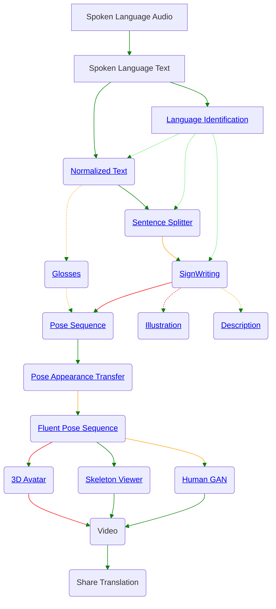

This pipeline in fact represents two types of approaches to translation:

1. **Dictionary Based Translation**
2. **SignWriting based Machine Translation**

### Dictionary Based Translation[^dictionary-baseline]

[^dictionary-baseline]: Moryossef et al. 2023. [An Open-Source Gloss-Based Baseline for Spoken to Signed Language Translation](https://aclanthology.org/2023.at4ssl-1.3/).

The dictionary-based translation approach aims to simplify the translation but sacrifices the fluency and natural expressiveness needed for accurate sign language communication. It can be characterized by the following general steps:

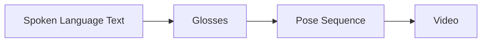

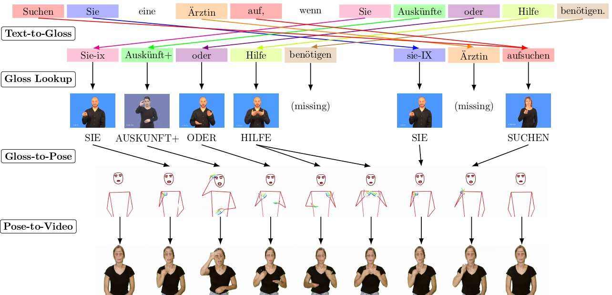

#### **Main Translation Steps**

1. **text-to-gloss translation**: The input spoken language text is transformed into glosses using techniques such as lemmatization, word reordering, and dropping unnecessary words (like articles).

2. **gloss-to-pose conversion**: ‘Glosses’ are mapped to corresponding skeletal poses extracted from a sign language dictionary.

3. **pose-to-video rendering**: The pose sequences are stitched together and rendered back into a synthesized human video.

#### **Data Requirements**

A dictionary of sign language videos for isolated letters, words, and phrases. This dictionary cannot represent the full expressiveness of sign language.

#### **Potential Quality**

Even if the dictionary is complete, this approach cannot fully capture the complexity of sign language. While it attempts to translate from text to a gloss-based structure and map that to movements (poses), it fails to account for the full grammatical and syntactic richness of sign language. Glosses are an incomplete representation of actual signs, and grammar in sign language differs substantially from spoken languages.

### SignWriting based Machine Translation

The machine translation approach aims to achieve similar translation quality to spoken language translation systems such as Google Translate, with potentially high fluency and natural expressiveness. This approach further allows for bi-directional translation, between signed and spoken languages.

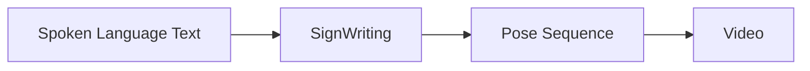

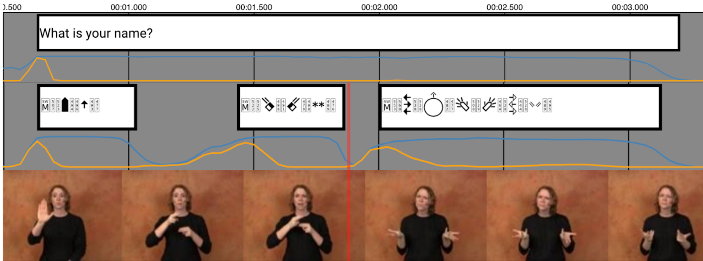

#### **Main Translation Steps:**

1. **text-to-SignWriting Translation**: Spoken language text is translated into SignWriting sequences using machine translation (it sees a lot of data, and extrapolates from it).

2. **SignWriting-to-pose conversion**: The written signs are converted into a fluent pose sequence, illustrating how the signs would be physically performed by a signer.

3. **pose-to-video rendering**: This pose sequence is then rendered into a human video.

#### **Data Requirements:**

By combining a relatively small dataset of transcribed single signs (~100k) with a relatively small dataset of segmented continuous signs, and leveraging large video/text sign language datasets, we can automatically transcribe the latter. This process will generate large synthesized datasets for both **text-to-SignWriting** and **SignWriting-to-pose** conversions.

#### **Potential Quality**

The system aims to accurately represent sign language grammar and structure, allowing for a good translation of both lexical and non-lexical signs, expressions, and classifiers.
Potentially, the system can be as good as a deaf human translator, given quality data.

#### **Motivating Examples**

##### Robustness to minor inconsequential changes

Here is an example where a minor, inconsequential, and possibly even **wrong** modification to the spoken language yields the same correct translation in SignWriting (the sign for the city of zurich) but the dictionary yields different ones.

| Text                                                         | Machine Translation                                                                | Dictionary Translation                          |
| ------------------------------------------------------------ | ---------------------------------------------------------------------------------- | ----------------------------------------------- |
| [Zürich](https://sign.mt/?spl=de&sil=sgg&text=Z%C3%BCrich)   | 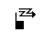  | The sign for Zurich (correct)                   |
| [Zurich](https://sign.mt/?spl=de&sil=sgg&text=Zurich)        |   | Spelling the city name without umlaut (strange) |
| [Züerich](https://sign.mt/?spl=de&sil=sgg&text=Z%C3%BCerich) | 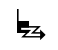 | Spelling the city name (strange)                |

##### Adaptivity to minor important changes

Here is an example where a minor, important modification to the spoken language (exclamation) yields different, correct translations in SignWriting (reflecting the emotion) but the dictionary yields the same one.
Changing to question mark, the face correctly become questioning (even though the SignWriting is not perfect).

| Text                                                                  | Machine Translation                                                                               | Dictionary Translation                                |
| --------------------------------------------------------------------- | ------------------------------------------------------------------------------------------------- | ----------------------------------------------------- |
| [Hello world.](https://sign.mt/?spl=en&sil=ase&text=Hello%20world.)   | 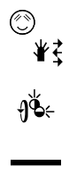        | The sign for "Hello" followed by the sign for "World" |
| [Hello world!](https://sign.mt/?spl=en&sil=ase&text=Hello%20world!)   | 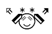   | The sign for "Hello" followed by the sign for "World" |
| [Hello world?](https://sign.mt/?spl=en&sil=ase&text=Hello%20world%3F) | 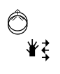 | The sign for "Hello" followed by the sign for "World" |

## Signed to Spoken Language Translation

Following, is a flowchart of the current translation pipeline from signed to spoken language.

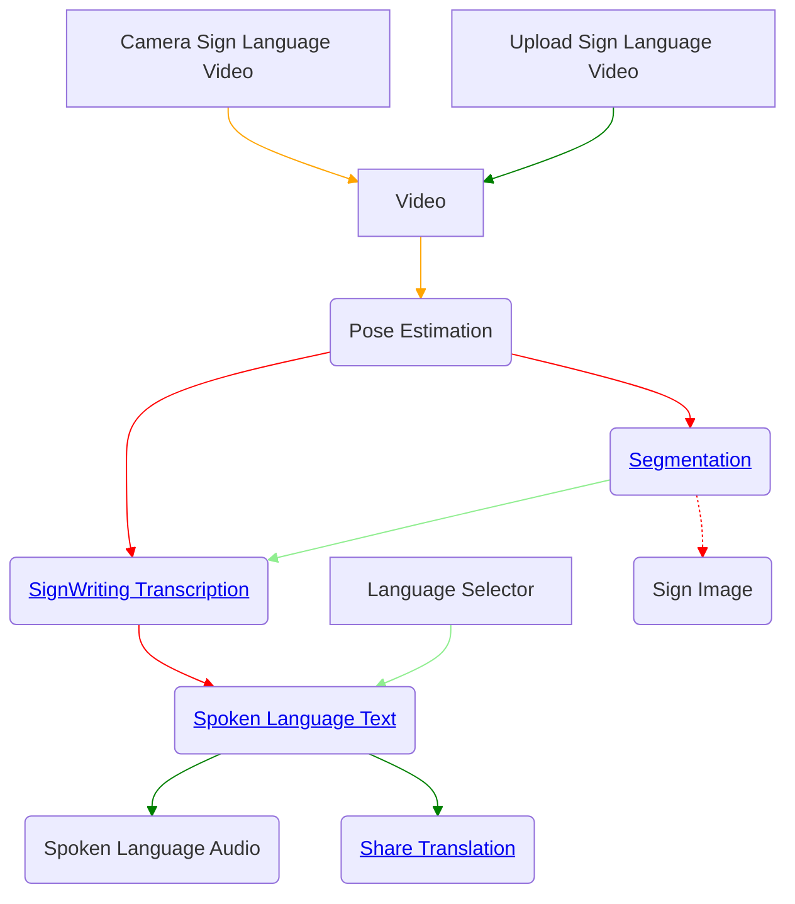
