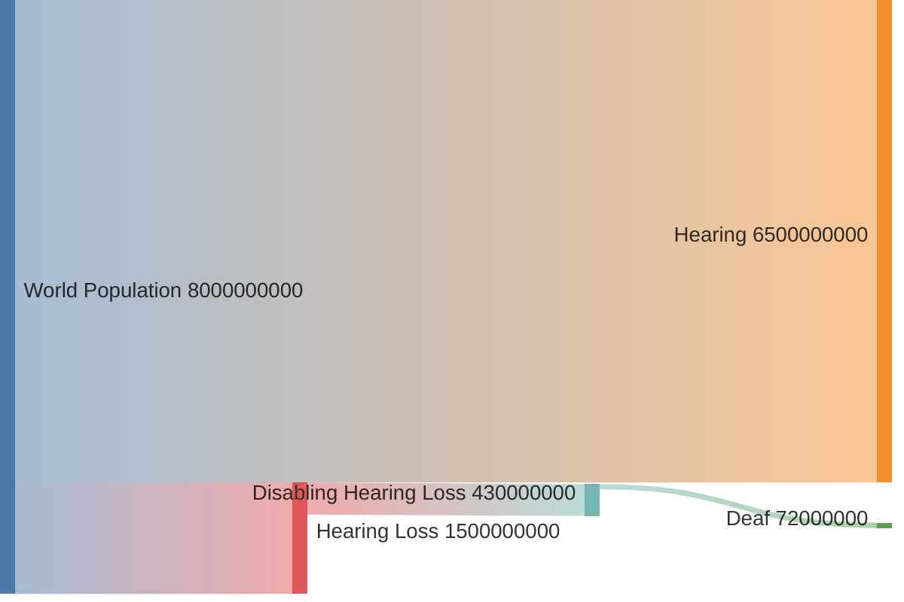

# Numbers

Understanding the scale and impact of hearing loss is essential for assistive technologies.
This section explores the global funnel from hearing loss to deafness and its significance.

1. **1.5 billion people** experience hearing loss globally.
2. **430 million people** require rehabilitation for disabling hearing loss.
3. **70 million people** are considered deaf.
4. **Unclear** how many people use sign languages.

### Hearing Loss[^who]

The **World Health Organization (WHO)** estimates that globally, **1.5 billion people** live with some degree of hearing loss, a number expected to rise to **2.5 billion by 2050**.
Of these, **430 million people** experience disabling hearing loss, requiring rehabilitation to improve quality of life.
By 2050, this number is projected to grow to **700 million**.

::: info Quote: Relevance
Unaddressed hearing loss poses an annual global cost of US$ 980 billion.
This includes health sector costs (excluding the cost of hearing devices), costs of educational support, loss of productivity and societal costs.
:::

[^who]: World Health Organization. 2021. [Fact Sheet: Deafness and Hearing Loss](https://www.who.int/news-room/fact-sheets/detail/deafness-and-hearing-loss).

### Deafness[^wfd]

Among those with disabling hearing loss, the **World Federation of the Deaf (WFD)** estimates there are approximately **70 million deaf people worldwide**.
This community spans over **200 sign languages**, underlining the linguistic diversity of deaf populations.
From our research, it is unclear how many people use sign languages.

[^wfd]: World Federation of the Deaf. 2024. [Our Work](https://wfdeaf.org/our-work/).
